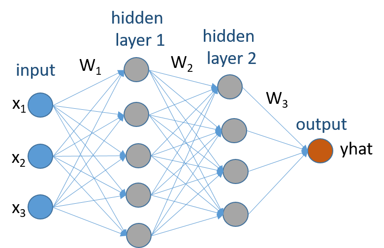

### Machine Learning for Embedded System course @ TalTech
Implement in C neural network with 2 hidden layer as shown in the picture below. It has 3 inputs, 5 neurons in the first hidden layer, 4 neurons in the second hidden layer and one output neuron. Network is fully connected. For the hidden layers use ReLu as non-linear activation function. For output neuron use Sigmoid as non-linear activation function.

